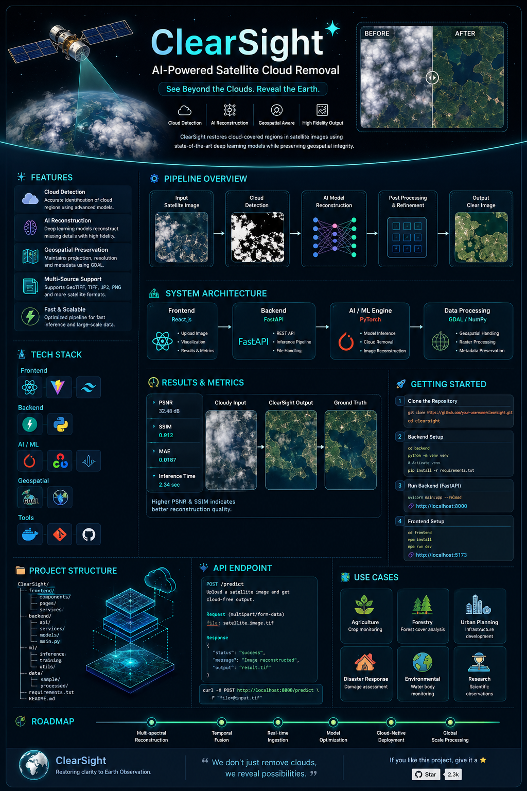

<div align="center">

# 🛰️ ClearSight

### AI-Powered Satellite Cloud Removal & Earth Observation Reconstruction


<p>
  <b>🌍 Restore • Reconstruct • Reveal</b>
</p>

<p>
  
  
  
  
</p>

<p>
  
  
  
</p>

> **Clouds hide information. ClearSight brings it back.**

</div>

---
<div align="center">



---
</div>
# 🌎 The Problem

Satellite imagery is one of humanity's most powerful tools for understanding Earth.

But there is a problem:

```text
       ☁️ ☁️ ☁️ ☁️ ☁️
    ☁️  CLOUD-COVERED  ☁️
  ☁️    SATELLITE       ☁️
       IMAGE DATA
          ↓
     ❌ Missing Pixels
     ❌ Hidden Features
     ❌ Broken Analysis
```

Cloud contamination can make satellite imagery difficult to use for:

* 🌾 Agricultural monitoring
* 🌲 Forest analysis
* 🏙️ Urban development
* 🌊 Water-body monitoring
* 🔥 Disaster assessment
* 🗺️ Land-cover classification
* 🌍 Environmental observation

### ClearSight's mission

> **Use AI to reconstruct information hidden beneath cloud-covered regions while preserving the spatial structure of satellite imagery.**

---

# 🛰️ What is ClearSight?

**ClearSight** is an AI-powered satellite image reconstruction system designed to remove cloud-obscured regions from Earth observation imagery.

The system combines:

```text
Satellite Imagery
       │
       ▼
┌──────────────────┐
│ Image Ingestion  │
└────────┬─────────┘
         ▼
┌──────────────────┐
│ GDAL Processing  │
└────────┬─────────┘
         ▼
┌──────────────────┐
│ Cloud Detection  │
└────────┬─────────┘
         ▼
┌──────────────────┐
│ AI Reconstruction│
└────────┬─────────┘
         ▼
┌──────────────────┐
│ Quality Analysis │
└────────┬─────────┘
         ▼
🌍 Cloud-Free Output
```

---

# ✨ Core Features

| Feature                         | Description                                  |
| ------------------------------- | -------------------------------------------- |
| ☁️ **Cloud Detection**          | Identifies cloud-obscured regions            |
| 🧠 **AI Reconstruction**        | Predicts missing visual information          |
| 🛰️ **Satellite Support**       | Designed for geospatial raster imagery       |
| 🗺️ **Geospatial Preservation** | Maintains spatial metadata                   |
| ⚡ **FastAPI Backend**           | Lightweight inference API                    |
| 🖥️ **Interactive UI**          | Upload → Process → Visualize                 |
| 📊 **Quality Metrics**          | Compare reconstructed imagery                |
| 🔬 **Image Preprocessing**      | Normalization, resizing and patch extraction |
| 📦 **Modular Architecture**     | Separate frontend, backend and ML layers     |

---

# 🎬 See ClearSight in Action

<div align="center">

<!-- Replace with your actual demo GIF -->


### ☁️ Cloudy Image → 🧠 AI Reconstruction → 🌍 Clear Image

</div>

> 💡 **Tip:** Add a short 10–20 second GIF here showing the complete workflow.
> It instantly makes the repository feel like a real product rather than a college project.

---

# 🧬 How ClearSight Works

## 01 — 📥 Image Ingestion

The user uploads satellite imagery such as:

```text
.tif
.tiff
.jp2
.png
.jpg
```

GDAL is used for geospatial raster handling.

```python
from osgeo import gdal

dataset = gdal.Open("satellite_image.tif")

image = dataset.ReadAsArray()

print(image.shape)
```

---

## 02 — 🛰️ Geospatial Preprocessing

ClearSight extracts:

```text
┌────────────────────────────┐
│ Satellite Raster           │
├────────────────────────────┤
│ Spectral Bands             │
│ Resolution                 │
│ CRS / Projection           │
│ GeoTransform               │
│ Metadata                   │
└────────────────────────────┘
```

The image is then transformed into a format suitable for the AI pipeline.

---

## 03 — ☁️ Cloud Identification

Cloud-covered regions are identified using the available cloud-mask / detection pipeline.

Conceptually:

```text
Satellite Image
       │
       ▼
┌─────────────────┐
│ Cloud Detection │
└────────┬────────┘
         │
     ┌───┴────┐
     ▼        ▼
  CLEAR     CLOUD
  PIXELS    PIXELS
     │        │
     │        ▼
     │    Missing Area
     │
     └──────┬───────┘
            ▼
      AI Reconstruction
```

---

# 🧠 AI Reconstruction Pipeline

The central intelligence of ClearSight is the image reconstruction model.

```text
             INPUT IMAGE
                  │
                  ▼
        ┌──────────────────┐
        │   Preprocessing  │
        └────────┬─────────┘
                 │
                 ▼
        ┌──────────────────┐
        │ Cloud Mask       │
        └────────┬─────────┘
                 │
                 ▼
        ┌──────────────────┐
        │ Feature Encoder  │
        └────────┬─────────┘
                 │
                 ▼
        ┌──────────────────┐
        │ AI Reconstruction│
        └────────┬─────────┘
                 │
                 ▼
        ┌──────────────────┐
        │ Decoder / Output │
        └────────┬─────────┘
                 │
                 ▼
           CLEAR IMAGE
```

The architecture can be adapted depending on the trained model, including approaches such as:

* U-Net
* Autoencoder
* GAN-based reconstruction
* Diffusion-based reconstruction
* Transformer-based image restoration

---

# 🔬 Model Pipeline

```text
               ┌──────────────┐
               │ Satellite    │
               │ Image        │
               └──────┬───────┘
                      │
                      ▼
               ┌──────────────┐
               │ Normalize    │
               └──────┬───────┘
                      │
                      ▼
               ┌──────────────┐
               │ Cloud Mask   │
               └──────┬───────┘
                      │
                      ▼
        ┌──────────────────────────┐
        │      AI MODEL            │
        │                          │
        │ Encoder → Latent →       │
        │ Decoder                  │
        └────────────┬─────────────┘
                     │
                     ▼
              ┌──────────────┐
              │ Reconstruction│
              └──────┬───────┘
                     │
                     ▼
              ┌──────────────┐
              │ Postprocess  │
              └──────┬───────┘
                     │
                     ▼
               🌍 OUTPUT TIFF
```

---

# 🏗️ System Architecture

<div align="center">

```text
                         ┌────────────────────┐
                         │      USER          │
                         └─────────┬──────────┘
                                   │
                                   ▼
                         ┌────────────────────┐
                         │    React.js UI     │
                         └─────────┬──────────┘
                                   │
                              REST API
                                   │
                                   ▼
                         ┌────────────────────┐
                         │      FastAPI       │
                         └─────────┬──────────┘
                                   │
                 ┌─────────────────┼─────────────────┐
                 │                 │                 │
                 ▼                 ▼                 ▼
          ┌────────────┐    ┌────────────┐    ┌────────────┐
          │   GDAL     │    │ ML Model   │    │  NumPy     │
          │ Processing │    │ Inference  │    │ Processing │
          └──────┬─────┘    └──────┬─────┘    └────────────┘
                 │                  │
                 └──────────┬───────┘
                            ▼
                   ┌────────────────┐
                   │ Reconstructed  │
                   │ Satellite Data │
                   └───────┬────────┘
                           │
                           ▼
                    🌍 ClearSight
```

</div>

---

# 🛠️ Technology Stack

<div align="center">

### Frontend


### Backend


### AI / ML


### Geospatial

**GDAL • Raster Processing • GeoTIFF • NumPy**

### Development


</div>

---

# 📁 Project Structure

```text
ClearSight/
│
├── 📁 frontend/
│   ├── components/
│   ├── pages/
│   ├── services/
│   └── App.jsx
│
├── 📁 backend/
│   ├── api/
│   ├── services/
│   ├── models/
│   ├── preprocessing/
│   └── main.py
│
├── 📁 ml/
│   ├── datasets/
│   ├── checkpoints/
│   ├── training/
│   ├── inference/
│   └── evaluation/
│
├── 📁 data/
│   ├── raw/
│   ├── processed/
│   └── samples/
│
├── 📁 assets/
│   ├── demo.gif
│   ├── architecture.png
│   └── screenshots/
│
├── 📄 requirements.txt
├── 📄 package.json
├── 📄 Dockerfile
└── 📄 README.md
```

---

# ⚙️ Installation

## Prerequisites

Make sure you have:

```text
Python >= 3.10
Node.js >= 18
npm
Git
GDAL
```

---

## 1️⃣ Clone the Repository

```bash
git clone https://github.com/YOUR_USERNAME/YOUR_REPOSITORY.git

cd ClearSight
```

---

# 🐍 2️⃣ Backend Setup

Create a virtual environment:

```bash
python -m venv venv
```

### Windows

```bash
venv\Scripts\activate
```

### Linux / macOS

```bash
source venv/bin/activate
```

Install dependencies:

```bash
pip install -r requirements.txt
```

---

# 🛰️ 3️⃣ Install GDAL

### Conda — Recommended

```bash
conda install -c conda-forge gdal
```

Verify:

```bash
python -c "from osgeo import gdal; print(gdal.__version__)"
```

---

# ⚡ 4️⃣ Start FastAPI

```bash
uvicorn backend.main:app --reload
```

Backend:

```text
http://localhost:8000
```

API documentation:

```text
http://localhost:8000/docs
```

---

# ⚛️ 5️⃣ Frontend Setup

```bash
cd frontend

npm install
```

Start development server:

```bash
npm run dev
```

Open:

```text
http://localhost:5173
```

---

# 🚀 Quick Start

Once both servers are running:

```text
             🌐 Browser
                 │
                 ▼
        ┌─────────────────┐
        │ Upload Satellite│
        │ Image            │
        └────────┬────────┘
                 │
                 ▼
          ☁️ Cloud Detection
                 │
                 ▼
          🧠 AI Processing
                 │
                 ▼
        🌍 Reconstructed Image
                 │
                 ▼
             Download
```

---

# 🔌 API

## Upload Image

```http
POST /predict
```

Example:

```bash
curl -X POST \
  http://localhost:8000/predict \
  -F "file=@satellite.tif"
```

Response:

```json
{
  "status": "success",
  "message": "Image reconstructed successfully",
  "output": "reconstructed.tif"
}
```

---

# 📊 Evaluation

ClearSight can evaluate reconstruction quality using image-restoration metrics.

### PSNR

Measures pixel-level reconstruction similarity.

```text
Higher PSNR → Better reconstruction
```

### SSIM

Measures structural similarity.

```text
Higher SSIM → Better structural preservation
```

### MAE / MSE

Measures reconstruction error.

```text
Lower Error → Better reconstruction
```

---

# 📈 Results

<div align="center">

|       Metric       |  Score |
| :----------------: | :----: |
|      **PSNR**      |  XX dB |
|      **SSIM**      |   XX   |
|       **MAE**      |   XX   |
| **Inference Time** | XX sec |

</div>

> Replace these placeholders with your actual evaluation results. Never put invented metrics in the README.

---

# 🖼️ Before vs After

<div align="center">

|               ☁️ Cloudy Input               |                 🧠 ClearSight                |                   🌍 Ground Truth                  |
| :-----------------------------------------: | :------------------------------------------: | :------------------------------------------------: |
|  |  |  |

</div>

---

# 🧪 Example Workflow

```python
from osgeo import gdal
import numpy as np

# Load satellite image
dataset = gdal.Open("input.tif")

# Read raster
image = dataset.ReadAsArray()

# Normalize
image = image.astype(np.float32)

image = (
    image - image.min()
) / (
    image.max() - image.min()
)

# Model inference
prediction = model.predict(image)

# Save reconstructed image
# Preserve original geospatial metadata
```

---

# 🌐 Use Cases

### 🌾 Agriculture

Monitor crops despite cloud contamination.

### 🌲 Forestry

Improve forest-cover monitoring.

### 🏙️ Urban Planning

Recover visual information for regions affected by cloud cover.

### 🌊 Environmental Monitoring

Analyze water bodies and environmental changes.

### 🔥 Disaster Response

Improve accessibility of satellite imagery when cloud cover obstructs observations.

---

# 🔮 Future Roadmap

```text
✅ Satellite image preprocessing
✅ Cloud detection
✅ AI reconstruction pipeline
✅ FastAPI inference backend
✅ Interactive frontend

🔄 Multi-spectral reconstruction
🔄 Large-scale batch processing
🔄 GPU acceleration
🔄 Model benchmarking
🔄 Advanced quality metrics

🚀 Real-time satellite ingestion
🚀 Temporal image fusion
🚀 Multi-temporal reconstruction
🚀 Cloud-native deployment
🚀 Explainable AI visualization
```

---

# 🧠 Why ClearSight?

Most image restoration systems focus purely on making an image *look better*.

ClearSight is designed around a different idea:

> **Satellite imagery is not just an image — it is geospatial information.**

Therefore, the pipeline considers:

```text
Visual Quality
      +
Spectral Information
      +
Spatial Information
      +
Geographic Metadata
      ↓
Meaningful Reconstruction
```

---

# 🏆 Hackathon Vision

<div align="center">

### 🌍 From Obstructed Earth Observation

### ↓

### 🧠 Through Artificial Intelligence

### ↓

### 🛰️ To Clearer Earth Intelligence

</div>

ClearSight explores how AI can transform incomplete satellite observations into more usable geospatial information.

---

# 👨‍💻 Development

Want to contribute?

```bash
git checkout -b feature/amazing-feature

git add .

git commit -m "Add amazing feature"

git push origin feature/amazing-feature
```

Then open a Pull Request.

---

# 📜 License

This project is released under the **MIT License**.

---

<div align="center">

## 🛰️ ClearSight

**Seeing Beyond the Clouds.**


⭐ **If ClearSight helped or inspired you, consider starring the repository.**

</div>
